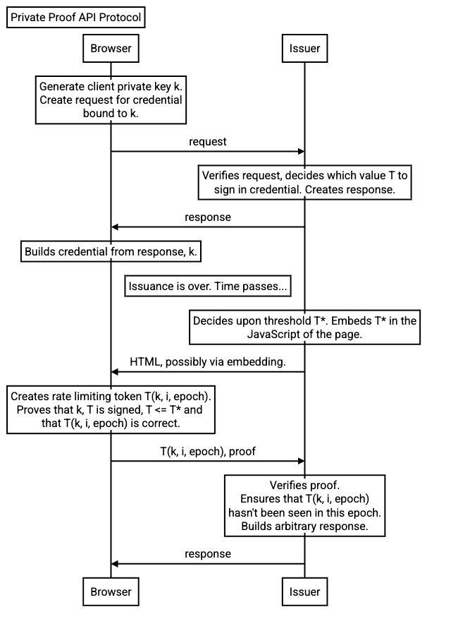

# Explainer: Private Proof API

This proposal is an early design sketch by Privacy Sandbox to describe the problem below and solicit feedback on the proposed solution.
It has not been approved to ship in Chrome.

* [Discussion](https://github.com/explainers-by-googlers/private-proof/issues)

## Introduction

Protecting users from online fraud and abuse is a shared responsibility between websites and user agents.
Historically, unpartitioned storage and third-party cookies (3PC) enabled services to recall when a client was first seen (as well as tracking subsequent events for examining “normal” behavior).
This helped established users distinguish themselves from novel clients during Sybil attacks (multiple fake identities) or other spammy behavior, granting established users frictionless access to online services.
However, the reduced availability of 3PC and limitations on unpartitioned local storage necessitate a paradigm shift in anti-fraud mechanisms.

Without a viable client-side alternative to provide anti-fraud capabilities, organizations may resort to less precise and potentially less private solutions like device fingerprinting, or compromising user experience through added user friction, such as requests to log in or excessive CAPTCHA puzzles.
The proposed Private Proof API offers a privacy-centric solution, ensuring that users are not unduly burdened while websites implement effective fraud prevention capabilities.

This API uses Zero-Knowledge Proofs (ZKPs) to allow analysis of potentially identifiable signals while providing only a limited verdict output.
For example, it empowers anti-fraud services to verify whether a user possesses an unmodified stored timestamp older than some provided timestamp without disclosing any additional user data.
This approach strikes a balance between user privacy and anti-fraud capabilities by enabling websites to request a reputation signal (such as [profile age](https://github.com/antifraudcg/proposals/issues/9)) on which the user agent can enforce meaningful privacy constraints, while making the signal useful enough to remove the need for other burdensome or invasive checks, and allowing the user to clear said signal at will.

## Goals

* Reduce challenge friction for likely-benign users
* Offer a verifiable, low-bit function evaluation on state kept within the browser
* Allow data to be targeted for clearing, and clear the data automatically alongside other site data
* Allow to run on arbitrary hardware and browsers

## Non-Goals

* Increase challenge friction for novel users
* Provide a new mechanism for cross-site tracking
* Provide a non-clearable reputation score

## Use Cases

While the client is usually considered untrusted, anti-fraud vendors often use client side signals and storage as an important complement to server-side or offline fraud analysis and detection.
Many fraud and spam fighting organizations across a wide range of verticals look for discrepancies and anomalies between expected and observed client signals and behavior.

### Bot detection: finding anomalies in client or cookie age

Since user storage is easily cleared, spammers tend to clear their state in an attempt to look like a new user, say to boost views or alter billable stats.
While websites do not want to discourage new users, they need to limit fraud and spam, and can do so in aggregate by looking for anomalies in “new” users compared to baseline distributions.

We already see this use case with the SelectURL Shared Storage API, which can be used to build a client age distribution and warn of discrepancies in access patterns. However, an implementation based on those APIs lacks verification and is vulnerable to tampering. See [example 1](https://docs.google.com/presentation/d/1XXgpwQLmfh87oQ3q5I3mzocUjLdjtTQMqLMLGb2nIMY/edit#slide=id.g2c78a183f9f_7_530)  and  [example 2](https://docs.google.com/presentation/d/1-VjSchD47FoLK1e_Iv4b6DGsUb70JE5No3VG_zLptbY/edit#slide=id.g3041befa8d0_6_325).

### Payment protection: prior successful transactions

Payment providers often do per-card verifications for online transactions to mitigate the risk of theft.
While payment providers know many details about the cardholder and their identity is not private at checkout, it can be useful for payment providers to verify a checkout has been completed on the client previously.
Future work may also unlock additional functionality for this use case.

## Proposed Solution

Our solution seeks to provide a JavaScript context with a way to make a request to store a signed integer token from its own site.
Contexts on that same site could then make a request for proof to be sent back to the site, that the token is less than or equal to some bound (without disclosing the value of the integer stored itself).

For example: a site requests that a token be stored, which represents a current timestamp.
The site then makes a request for proofs to be sent back which demonstrate that the user account is at least one month old, as a trust signal.

See the following sequence diagram for an overview of the API flow:



### Zero-Knowledge Proofs

The cryptography underpinning the Private Proof API is outlined in the whitepaper: [Anonymous Credentials with Range Proofs and Rate Limiting](https://github.com/SamuelSchlesinger/authenticated-pseudonyms/blob/dev/design/Range.pdf).
This approach leans on the existing Anonymous Credentials literature and the many techniques which have been developed to communicate authenticated information without revealing any longitudinal identifiers.
We take inspiration from papers such as:

* [Sharp: Short Relaxed Range Proofs](https://ia.cr/2022/1153)
* [A Verifiable Random Function With Short Proofs and Keys](https://eprint.iacr.org/2004/310.pdf)
* [Revisiting Keyed-Verification Anonymous Credentials](https://eprint.iacr.org/2024/1552)
* [Revisiting BBS Signatures](https://ia.cr/2023/275)
* [How to Win the Clone Wars: Efficient Periodic n-Times Anonymous Authentication](https://eprint.iacr.org/2006/454)

The five core algorithms required for our proposed solution are described below, and these are used in the Token Storage and Proof Generation sections.
For further details on the importance of `EPOCH_*` variables and rate-limiting see the Token Distribution section.

#### Token Request Algorithm

The user agent performs this algorithm to request a token from the server.

```
Inputs:
  EPOCH_LIMIT_SECRET: Browser's private epoch-limit key
Intermediate:
  EPOCH_LIMIT_PUBLIC: Public epoch-limit key generated from EPOCH_LIMIT_SECRET
  EPOCH_LIMIT_PROOF: A bytestring representing a zero-knowledge proof of
                    knowledge of EPOCH_LIMIT_SECRET.
Output:
  REQUEST: Bytestring containing EPOCH_LIMIT_PUBLIC and EPOCH_LIMIT_PROOF
```

#### Token Issuance Algorithm

This algorithm is performed by the server issuing a token to be stored by the user agent.

```
Inputs:
  SITE_SECRET: Server's private key
  REQUEST: Bytestring containing EPOCH_LIMIT_PUBLIC and EPOCH_LIMIT_PROOF
  VALUE: Integer to sign (Between 0 and 236/3)
Intermediate:
  SIG: Signature of REQUEST and VALUE using SITE_SECRET
Output:
  TOKEN: Bytestring containing VALUE and SIG
```

#### Token Verification Algorithm

This algorithm is executed by the user agent to verify that the token they received was issued using the public key that they expect.

```
Inputs:
  EPOCH_LIMIT_SECRET: Browser's private epoch-limit key
  SITE_PUBLIC: Public key generated from SITE_SECRET
  TOKEN: Bytestring containing VALUE and SIG
Output:
  VALID: Boolean indicating whether TOKEN was issued using EPOCH_LIMIT_SECRET
         and SITE_PUBLIC.
```

#### Proof Generation Algorithm

This algorithm is executed by the user agent to produce a proof that the token contained within the browser is less than or equal to some other value.

```
Inputs:
  EPOCH_LIMIT_SECRET: Browser's private epoch-limit key
  SITE_PUBLIC: Public key generated from SITE_SECRET
  TOKEN: Bytestring containing VALUE and SIG
  BOUND: Integer which we want to prove VALUE is less than or equal to
  EPOCH_LENGTH: Integer in seconds representing the length of a given epoch
                for rate limiting purposes.
  EPOCH_LIMIT: Integer between 0 and 2^17 exclusive representing the maximum
               tokens possible to issue in a given epoch.
  COUNTER: Amount of proofs issued in current epoch (excluding this one).
  PROOF_ID: String used to trace this specific proof generation request.
Intermediates:
  EPOCH: The current epoch according to EPOCH_LENGTH and the current time.
  EPOCH_LIMIT_RANDOM: Output of a VRF seeded by EPOCH_LIMIT_SECRET and applied 
                     to EPOCH and COUNTER.
  T_PROOF: Non-Interactive Zero-Knowledge Proof that TOKEN was issued using
           EPOCH_LIMIT_SECRET and SITE_PUBLIC, that VALUE <= BOUND, that
           EPOCH_LIMIT_RANDOM was properly calculated, that COUNTER <
           EPOCH_LIMIT, that the current time is within EPOCH, and of
           PROOF_ID's value.
Output:
  PROOF: Bytestring containing EPOCH_LIMIT_RANDOM and T_PROOF.
```

#### Proof Verification Algorithm

This algorithm is executed by the server to validate a proof from the user agent attempting to demonstrate that the browser’s private token is less than or equal to the value the server wants to compare it to.

```
Inputs:
  SITE_SECRET: Server's private key
  PROOF: Bytestring containing EPOCH_LIMIT_RANDOM and T_PROOF.
  BOUND': Integer which we want to prove VALUE is less than or equal to
  EPOCH_LENGTH: Integer in seconds representing the length of a given epoch
                for rate limiting purposes.
  EPOCH_LIMIT: Integer between 0 and 2^17 exclusive representing the maximum
              tokens possible to issue in a given epoch.
  PROOF_ID: String used in generating PROOF to demonstrate provenance.
Intermediates:
  EPOCH: The current epoch according to EPOCH_LENGTH and the current time. The
         server may decide to try multiple EPOCHs (for example, the ones
         immediately before or after) to prevent issues around EPOCH
         boundaries.
Output:
  VALID: Boolean indicating whether or not PROOF is valid.

```

### Site Public Key and Epoch Limit Distribution

Any site wishing to use the Private Proof API must ensure that user agents have access to the public key they wish to use as `SITE_PUBLIC` in the Token Verification and Proof Generation Algorithms as well as the `EPOCH_LENGTH` and `EPOCH_LIMIT` used in the Proof Generation Algorithm.
This could be accomplished by publishing the public key and epoch limit in a [`.well-known`](https://datatracker.ietf.org/doc/html/rfc8615#section-3) location on the site.
Further, user agents must ensure that they are not seeing a different key or epoch limit than other user agents, as this could be used to de-anonymize the user agent.
This can be achieved via distribution of the public keys and epoch limit to the browser or some out of band auditing mechanism.

### Permissions Policy

We would create one new [policy-controlled feature](https://w3c.github.io/webappsec-permissions-policy/#policy-controlled-feature): “private-proofs”.
The default [allowlist](https://w3c.github.io/webappsec-permissions-policy/#policy-controlled-feature-default-allowlist) for this feature would be “*”, allowing all contexts (embedded or otherwise) to use the feature.
Using a default of “self” may seem preferable, but this would discourage adoption as it requires those using anti-abuse/anti-fraud systems wanting Private Proof API access to modify their top-frame headers.

### Token Storage

It will be possible to store a single `SITE_PUBLIC`, `EPOCH_LIMIT_SECRET`, `TOKEN`, and `COUNTER` (as described in the Zero Knowledge Proofs section) for any site.
Only `SITE_PUBLIC` must be known in advance of using this part of the API.

#### JavaScript API

The following JavaScript API will be exposed for use in HTTPS contexts:

```javascript
partial interface Window {

  // Returns the control interface for the Private Proof API. This
  // promise rejects if no public key has been distributed for the
  // site of the current frame, if this context is not https, if
  // the context does not have permission via the `private-proofs`
  // policy, or if rate limiting was exceeded for this function.
  Promise<PrivateProofManager> getPrivateProofManager();
};

// The control interface for the Private Proof API.
// Additional parts are in the 'Proof Generation' section.
partial interface PrivateProofManager {

  // Returns true if a token has already been stored for this site
  // and false otherwise. We depend on rate limiting in the call to
  // getPrivateProofManager to secure this API.
  Promise<boolean> hasToken();

  // Requests a token be issued by `url` and stores it for this
  // context's site. Returns true if the request was successful
  // and a valid token was stored; returns false if `url` was not
  // on the same site as the current context, if `url` is not HTTPS,
  // if no token is returned, if the token does not pass the Token
  // Verification Algorithm, or if rate limiting was exceeded for this
  // function.
  Promise<boolean> requestToken(USVString url);

  // Clears any stored token, does not reject if there is no token
  // stored. We depend on rate limiting in the call to
  // getPrivateProofManager to secure this API.
  Promise<void> clearToken();
}
```

#### HTTP API

When `requestToken()` is called this should trigger a process with access to the underlying data for the relevant site to randomly generate a new `EPOCH_LIMIT_SECRET`, run the Token Request Algorithm using it, and then perform a fetch request (from a context matching the context which called the API) to the `url` provided with the following HTTP Request JSON body:

```jsonc
{
  "type": "integer-token-request",
  // <request> is a base64 encoded string representing the REQUEST issued
  // by the Token Request Algorithm.
  "request": "<request>"
}
```

The fetch request may be redirected, even to other sites, but if any are non-HTTPS urls the fetch request will be aborted and `requestToken` will return false.

If the site wants to store a token in response, it should include the following HTTP Response JSON body with a 200 status:

```jsonc
{
  "type": "integer-token-issuance",
  // <issuance> is a base64 encoded string representing the TOKEN produced by
  // the Token Issuance Algorithm.
  "issuance": "<issuance>"
}
```

If the integer-token-request JSON is valid according to the Token Verification Algorithm then the `EPOCH_LIMIT_SECRET` used and `TOKEN` received will be stored for that site and that site’s `COUNTER` will be reset to 0.
If the integer-token-issuance JSON is missing or invalid or the status is not 200 the storage will be aborted without impacting any existing `EPOCH_LIMIT_SECRET`/`TOKEN/COUNTER` stored for that site and `requestToken` will return false.

### Proof Generation

It will be possible to generate `PROOF`s for any site with a stored `SITE_PUBLIC`, `EPOCH_LIMIT_SECRET`, `TOKEN`, `EPOCH_LIMIT`, `EPOCH_LENGTH`, and `COUNTER` (as described in the Zero Knowledge Proofs section).

#### JavaScript API

The following JavaScript API will be exposed for use in HTTPS contexts:

```javascript
// The control interface for the Private Proof API.
// Additional parts are in the 'Token Storage' section.
partial interface PrivateProofManager {
  // Generates a proof that the token stored is less than or equal to
  // `bound` and of the value of `id` using the Proof Generation Algorithm and
  // sends it to `url`. 
  // Returns the decoded JSON blob sent in response if the proof was
  // successfully generated and the status in response was 200; rejects 
  // if the Proof Generation Algorithm failed, if `url` was not on the
  // same site as this context, if `url` was not HTTPS, if the request
  // failed, if decoding the response fails, or if rate limiting was
  // exceeded for this function.
  Promise<any> sendProofForLessThanOrEqual(number bound, USVString id, USVString url);
}
```

#### HTTP API

When `sendProofForLessThanOrEqual()` is called this should trigger a process with access to the underlying data for the relevant site to run the Proof Generation Algorithm using `bound` and performs a fetch request (from a context matching the context which called the API) on `url` with the following HTTP Request JSON body:

```jsonc
{
  "type": "integer-lte-proof",
  // <proof> would be replaced with the base64 encoded string representing
  // the PROOF from the Proof Generation Algorithm.
  "proof": "<proof>",
  // <bound> would be replaced with the values used in the call to
  // `sendProofForLessThanOrEqual`. This information is required for
  // the Proof Validation Algorithm.
  "bound": <bound>,
  // <id> would be replaced with the values used in the call to
  // `sendProofForLessThanOrEqual`. This information is required for
  // the Proof Validation Algorithm.
  "id": <id>
}
```

The fetch request may be redirected, even to other sites, but if any are non-HTTPS URLs the fetch request will be aborted and `sendProofForLessThanOrEqual()` will reject.

If the server accepts and verifies the proof via the Proof Verification Algorithm then a status 200 should be set and the returned body should be valid JSON, otherwise `sendProofForLessThanOrEqual()` will be rejected.

## Example

Consider a user who visits the website for their local theater to buy a ticket for their favorite artist.
They encounter a challenge from the theater’s anti-fraud system, which trusts users who already passed a challenge more than a day ago.
Users who were not considered trusted would have to pass a challenge.

### Client Side

```javascript
function maybeRunChallenge() {
  const ppm = await window.getPrivateProofManager();

  // If a token was already set, let's try to validate it!
  const has_token = await ppm.hasToken();
  if (has_token) {
    const one_day_ago = Math.floor(Date.now() / 1000) - 24 * 60 * 60;
    try {
      // The UUID is used to tie this specific context to the proof validation.
      // This should be sent down by the server as part of loading the page.
      const uuid = getProofId();
      // This generates a proof and sends it back to the server for validation.
      const proof_result = await ppm.sendProofForLessThanOrEqual(
        one_day_ago, uuid, 'https://aaf.example/proof');
      // We can set cookies or other data returned.
      setDataFromProof(proof_result);
      // If the proof passed, we can bypass the challenge (and maybe set other
      // data).
      if (proofWasPassed(proof_result)) {
        return;
      }
    } catch (_) {
      // We do not want to clear the token here as we would end up clearing
      // the token it had aged into being able to produce valid proofs.
    }
  }

  // Since we lack a proof, we need to do the challenge.
  const challenge_result = await runChallenge();
  // We can set cookies or other data returned.
  setDataFromChallenge(challenge_result);
  // If the challenge passed we should request a token to bypass challenges
  // after a day.
  if (challengeWasPassed(challenge_result) && !has_token) {
    await ppm.requestToken('https://aaf.example/token');
  }
}
```

### Server Side

The server needs to respond to the integer-token-request JSON (in a request validated by successful challenge data) and generate a token using the current time as VALUE in the Token Generation Algorithm and send it back in integer-token-issuance JSON.

The server needs to respond to the integer-lte-proof JSON by (1) running the Proof Validation Algorithm and (2) send back cookies/data communicating that result in JSON form.
If the proof can be validated this would signify that the user agent passed verification at least a day ago, if the proof cannot be validated then storage has been cleared within the last day or the user agent has not been seen before. 

## Integrations

### Browser UX

There should be a way to clear Private Proof API data alongside other data in the user agent UX.
There should be a way to enable/disable the Private Proof API itself for specific or all sites.

### Clear-Site-Data Header

The Private Proof API data should be cleared if a “cookies” or “*” directives are received.

### Developer Tools

It should be possible to examine the underlying tokens stored and monitor token storage and proof generation requests for debugging purposes.

## Alternatives Considered

### Shared Storage API

We could store the token using the [Shared Storage API](https://wicg.github.io/shared-storage/) and make it available to be updated and read in additional contexts, but this significantly lowers data security.
If the token can be updated outside of the Private Proof API, then the source of the token itself is less certain.
For example: data could be being exfiltrated/infiltrated by some third-party script.
If the token can be read outside of the generation of proofs in the browser process, then although Shared Storage outputs are gated, this seems to lower the bar for data exfiltration (making the data accessible by a compromised renderer) for no clear benefit (as the token is essentially only valuable for proof generation).

### Fetch API Extension

This could be developed around a fetch extension to allow specific requests from the renderer to attach generated proofs instead of the proof exchange happening out-of-band.
This likely makes less sense as we anticipate proof generation to be strictly rate limited.
It would be better for the site to "bless" cookies used in future requests, rather than encourage dependence on requests generally including attached proofs.

### HTTP Proof Type API
We could allow the specific proof type (for example, < 1000) to be specified in the HTTP API instead of the JavaScript API.
However, this would require a second round trip and likely only make sense if we think there’s some reason to treat the specific type of proof generated as sensitive in some way.

## Privacy and Security Considerations

### Deterministic Identification

Randomness is integrated into the generation of `PROOF`s such that the same valid TOKEN on two machines would not generate the same `PROOF`  even if requested at the same time.

### Brute Force Identification

Public keys are distributed to user agents in advance of API usage instead of being read at the time the API is used for some site to prevent unique keys from being sent to each user agent.
If it were possible to send unique keys to each user agent, the server could then request a proof and attempt to validate every key they had against the proof, as a way to identify the user.
This could be effective if the site was dividing users into a limited number of pools (each of which shares a key) or if the total number of users were small.

### Bound Search

To prevent a site from searching the space of possible `VALUE`s using different `BOUND`s, there must be strict rate limiting on the number of proofs any given site can request in a given timeframe.
This limit would be enforced by the User Agent independent of `EPOCH_LENGTH` and `EPOCH_LIMIT`, which operate on a timescale defined by the site itself (see the Token Distribution section for the security concern those values seek to address).

### Public Suffixes

The definition of ‘site’ used for token storage and proof generation should be eTLD+1 as derived from the [Public Suffix List](https://publicsuffix.org/).
For some origin which allows public registration of subdomains (e.g., service.example) we do not want to allow tokens to be shared between the subdomains (e.g., mine.service.example and other.service.example).
Every subdomain should be forced into using only their own token to prevent information leaking between unassociated origins.

### Token Breadcrumb Identification

One could imagine a sophisticated attack where a site (for example, `tracking.example`) generated a series of sites for each user and set tokens for each of them (for example, the user “test” would have tokens set on `t.example`, `te.example`, `tes.example`, and `test.example`).
This would allow deanonymization of the user through third-party contexts exploring down the alphabetical tree to see where the trail of tokens lead.
This should be countered through rate limits on a per-unit-time, per-page, per-site (or some combination) basis for `getPrivateProofManager()`, `requestToken()`, and/or `sendProofForLessThanOrEqual()` to prevent significant call volumes and allow deanonymization.
Further, limits could be imposed on the maximum number of tokens to be stored on any given client.

### Side Channels

One could imagine some third-party site embedded in two other top-level sites both calling `requestToken()`, `clearToken()`, and `hasToken()` purely as a way of transmitting bits based on the pattern of token clears and sets.
This should be prevented with rate limits on `requestToken()`, based on the site requesting the new token to be stored.
We'll try to prevent revealing information about other origins' use of the API, including when we're enforcing rate limiting.

### Token Distribution

There’s a risk that fraudulent/abusive users could copy the token between multiple machines in an attempt to abuse the "likely benign" reputation.
This is mitigated by the `EPOCH_LIMIT_RANDOM` sent back as part of the `PROOF` as described in the Zero Knowledge Proofs section.
Within a given epoch of time, each issued token will only be able to create a limited number of valid `EPOCH_LIMIT_RANDOM`s based on `EPOCH_LENGTH` and `EPOCH_LIMIT`.
The limit is designed to ensure that an individual user can properly use a website, while multiple attackers using the same issued token will find that they are not able to scale up their requests, only using one issued token, without violating their privacy and thus allowing them to be re-identified.
Instead, these attackers will have to revisit the issuer, allowing an opportunity to authenticate them again.

### Resource Consumption

The Proof Generation Algorithm is expected to be demanding on low end devices, so rate limits need to be imposed on `sendProofForLessThanOrEqual()` to prevent it from dominating CPU or power usage.
We should be sure to produce proofs as quickly and efficiently as possible to mitigate timing attacks and ensure this signal stays available on devices of all costs/ages.

### Process Isolation

Where possible we should ensure the renderer does not get direct access to underlying tokens so that a compromised renderer is not able to modify the signal directly or read it for tracking purposes.
This is why the design calls for async functions (to permit IPC to another process which manages access checks and data).

### Proof Tracing

Although we have mitigations to lower the value of sharing tokens between user agents or generating multiple proofs from the same token, there could still be residual value in exfiltrating individual proofs from trusted user agents for use to validate the actions of malicious ones (especially if the epoch window is wide and the epoch limit is high).
A developer can mitigate this risk by dynamically generating a UUID to identify a frame where content was loaded, and then use it in the call to `sendProofForLessThanOrEqual()` as the `id` argument.
This `id` will be tied to that proof and sent back as part of the proof validation request.
This helps ensure the same context that requested the proof is the one attempting to redeem it, and that the proof hasn’t been exfiltrated for use in some other unrelated transaction.

## Future Work

### Additional Predicates/Types

Although a ‘less than or equal’ predicate can assist with a number of use cases, we may want to expand to support others (e.g., ‘greater than’ or ‘set intersection’) over time.
Additionally, we might also need to support token types beyond integers (e.g., strings).
The API should be designed to enable this future expansion without over-adjusting in anticipation flows we don’t intend to implement now.

### Additional Algorithms

The `Private Proof Info` json includes information on the algorithm used.
This is to allow future Zero Knowledge Proof algorithms to be supported.
We may eventually need a way for the server and user agent to negotiate on the type of algorithms supported.

### Issuer Fungibility

Proof verifiers are currently limited to drawing inferences from tokens that were issued using their own signing key, even though additional tokens from other issuers with semantically equivalent content (e.g. a timestamp of when the client was first seen) could exist on the user agent.
One way to allow sharing of tokens without requiring sharing of private signing keys would be a [ring signature](https://en.wikipedia.org/wiki/Ring_signature).
If issuers collaborated through the use of a shared signature, the verifier could be sent tokens from any site in that group.
For the timestamp example, this could lead to a more accurate first-seen time as it would be the first time seen by any of the issuers in the group instead of each individually.
This approach would need to solve for:

1. Equity of access to issuer groups. Additional performance costs as new issuers are added to any given ring pressure groups to stay small.
1. The potential for some issuers in the group to issue invalid/incorrect tokens used in proofs for verifiers unable to know the source.
1. Forced convergence of semantics in a group (e.g., all tokens in a group must be a UTC timestamp) is at odds with generalization of proof systems.

## Related Work

### Encrypted data in third-party cookies

Historically, websites could evaluate whether a user was “first-seen” via third-party cookies.
Websites would encrypt a timestamp and set it as a third party cookie.
At a later time and in a different context, these websites could read the cookie and evaluate the timestamp.
This approach prevents the user from inspecting the contents of the cookie, exposes the high-entropy timestamp, and even allows the relay of unique identifiers alongside or instead of the timestamp.
This approach is becoming less viable with third-party cookies being disabled due to user choice or user agent default.

### Private State Token API

With the [Private State Token API](https://wicg.github.io/trust-token-api/), sites can transmit a predetermined value between storage partitioned contexts.
However, there are several limitations: first, the tokens issued to the browser are single use, meaning that if the user agent runs out of them they can no longer anonymously communicate that information.
Further, this means that we have to store a large number of them in the browser.
In contrast, the Private Proof API is able to keep only one token per-issuer in the browser at any given time, and generate unlinkable Zero-Knowledge Proofs using that single token.
There is still value in the rigidity of the issuance/redemption pattern in Private State Tokens, and signal from that API may be preferred to secure specific high-risk actions where client reputation alone would not suffice.

### Shared Storage API

The [Shared Storage API](https://wicg.github.io/shared-storage/) similarly provides unpartitioned storage with strict limitations on output gates.
The API is flexible and general purpose, with the design not limiting the flow of data between various inputs and output gates.
This storage provides no inherent signing or verification of the data within (any script running in the right context could set data).
